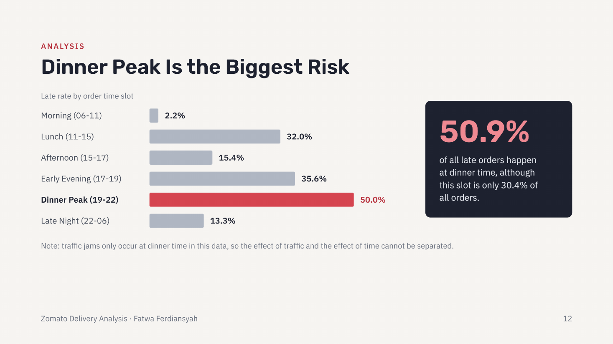
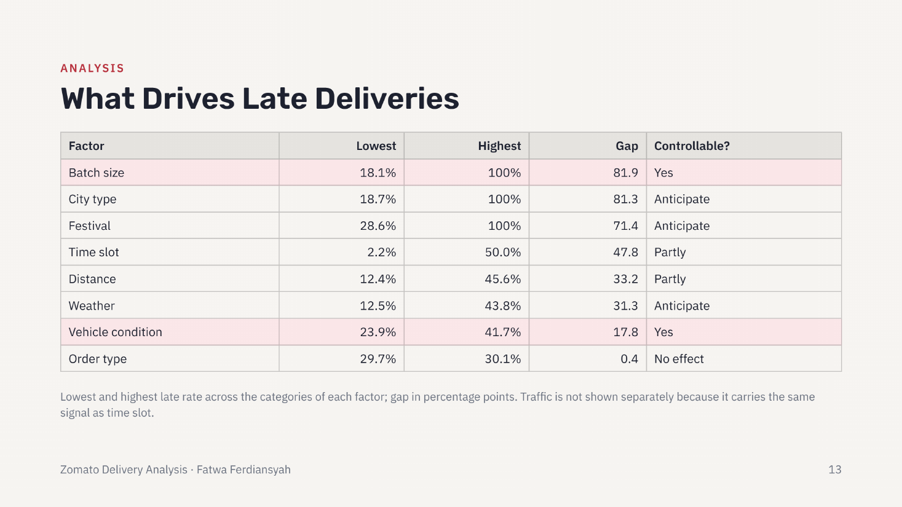
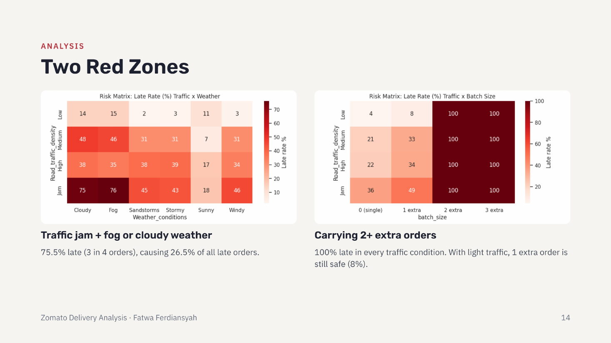
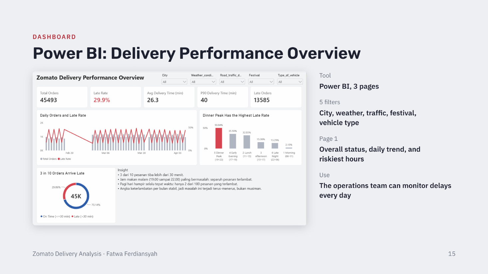
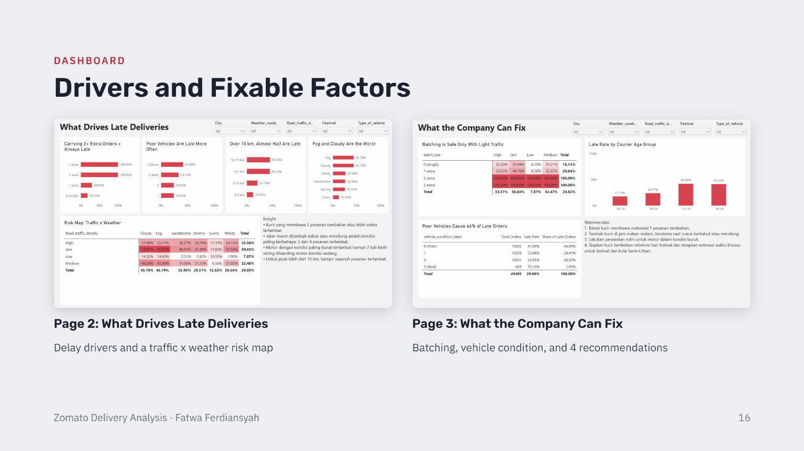

# Zomato Delivery Analysis: Why 3 in 10 Orders Arrive Late

**Which factors drive late food deliveries, and which of them can the company actually control?**

Fatwa Ferdiansyah · Take-Home Test, Data Analyst Bootcamp Dibimbing.id
[Portfolio](https://fatwaferdiansyah97-dev.github.io/data-analyst-portfolio/) · [LinkedIn](https://www.linkedin.com/in/fatwa-ferdiansyah-9951ba278) · [GitHub](https://github.com/fatwaferdiansyah97-dev)

---

## Business problem

From 11 February to 6 April 2022, **29.9% of 45,493 Zomato orders** arrived more than 30 minutes after ordering. At dinner time (7 to 10 PM) this rises to **50%**: one in two customers gets late food at the busiest hour. The company does not yet know which operational factors contribute most, and which ones it can control.

**Business questions**
1. What is the overall late rate, and how does it change by day and by hour?
2. Which factors create the biggest difference in late rate?
3. Which factors can the company control, and which can only be anticipated?
4. Which combination of conditions carries the highest risk of delay?

---

## Data

- **Source:** Zomato Delivery Operations Analytics (Kaggle)
- **Raw:** 45,584 orders, 20 columns, 0 duplicate rows, 8 columns with missing values (0.5% to 4.2%)
- **After cleaning:** 45,493 orders
- **New columns:** late status (over 30 minutes), distance (km), time slot, age group, rating group

---

## Data integrity findings

| Finding | Rows | Action |
|---|---|---|
| Courier age 15, all with rating 1 | 38 | Removed (placeholder data) |
| Rating 6 on a 1 to 5 scale, all at age 50 | 53 | Removed (placeholder data) |
| Restaurant coordinates equal to 0 | 3,640 | Distance left blank, rows kept |
| Negative restaurant coordinates | 431 | Converted to positive |
| Mixed time formats, including Excel fractions | 4,068 | Standardised to hours and minutes |
| Delivery time outliers above 51.5 min | 270 | Kept: these are the late cases under study |
| Courier IDs with more than one age | 1,320 IDs | One ID is not one person, so per-courier performance was not analysed |

Identical patterns (every age-15 courier rated 1, every rating-6 courier aged 50) point to test data mixed into real data.

---

## Key findings

- **29.9%** of orders are late (13,585 of 45,493). Average delivery time is 26.3 minutes; 90% arrive within 40 minutes.
- The **dinner peak (7 to 10 PM)** has a 50% late rate and holds **50.9% of all late orders**, although it is only 30.4% of orders.
- **Traffic jam plus fog or cloudy weather:** 75.5% late, causing 26.5% of all late orders.
- **Two or more extra orders per trip:** 100% late in every traffic condition (2,343 orders, 17% of all late orders). With light traffic, one extra order is still safe (8% late).
- **Motorcycles in poor condition:** 41.7% late vs about 24% in average condition.
- **Order type** (meal, snack, drinks, buffet) makes almost no difference: 29.7% to 30.1%.

**Caveat:** in this data, traffic jams only occur at dinner time, so the effect of traffic and the effect of time cannot be separated.

---

## Recommendations

1. **Cap batching at 1 extra order.** Orders with 2 or more extra deliveries were always late.
2. **Add couriers at the dinner peak**, with priority on foggy and cloudy nights.
3. **Maintain poor-condition motorcycles.** 42% late vs 24% for average condition.
4. **Festival and semi-urban playbook.** Add couriers before festival days and set a special delivery estimate. Both are 100% late today.

Findings show association, not proven cause. Each change should be tested in a pilot city first.

---

## Power BI dashboard (3 pages, 5 filters)

Filters: city, weather, traffic, festival, vehicle type.

| Page | Question answered |
|---|---|
| 1. Delivery Performance Overview | Overall status, daily trend, and riskiest hours |
| 2. What Drives Late Deliveries | Delay drivers and a traffic x weather risk map |
| 3. What the Company Can Fix | Batching, vehicle condition, and 4 recommendations |

---

## Files

| File | Contents |
|---|---|
| `Zomato_Delivery_Analysis.ipynb` | Data cleaning, feature engineering, and EDA (Python) |
| `Zomato_Delivery_Dashboard.pbix` | Interactive Power BI dashboard |
| `zomato_clean.csv` | Cleaned dataset used by the dashboard |
| [`Zomato Delivery Analysis.pdf`](Zomato%20Delivery%20Analysis.pdf) | Presentation slides |
| `assets/` | Charts and dashboard screenshots used in this README |

## Tools

`Python (Pandas, Google Colab)` `Power BI`
